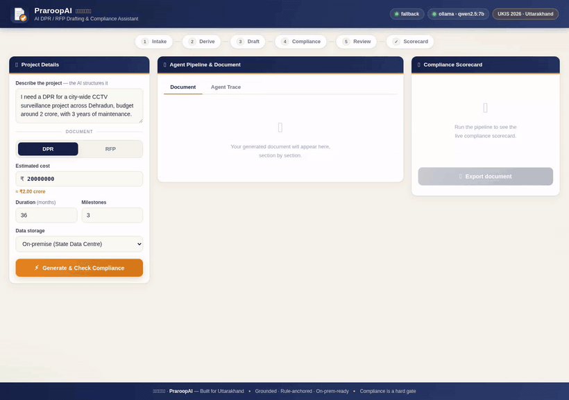
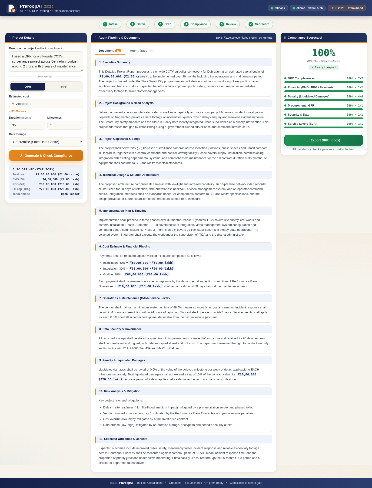

<div align="center">


# प्रारूप · PraroopAI

### AI DPR/RFP Drafting &amp; Compliance Assistant

*Draft it right the first time.*

**UKIS 2026 · ITDA, Government of Uttarakhand · Problem: DPR/RFP Drafting Assistant**


</div>

---

## See it work

<div align="center">



*Describe a project → agents draft it → the compliance critic finds the gaps →
the reviewer fixes them → the export gate unlocks at 100%.*

</div>

> 🎬 Higher-quality MP4: [`docs/media/demo.mp4`](docs/media/demo.mp4)

---

## What is PraroopAI?

Preparing a government **DPR** or **RFP** means satisfying dozens of mandatory rules —
financial norms, procurement/GFR guidelines, security requirements, service levels and
penalty clauses. Miss one clause and the tender is rejected or flagged in audit.

**PraroopAI** is a **LangGraph multi-agent system** that drafts the document with an LLM,
then hands it to a **deterministic compliance critic** that audits it against public
government rule-packs. Compliance is a **hard gate** — the document *cannot* be exported
while a mandatory check is failing.

| | |
|---|---|
| 🤖 **Multi-agent pipeline** | intake → derive → draft → compliance → reviewer, with a real feedback loop |
| 📡 **Live streaming** | the trace lights up node-by-node over SSE as each agent fires |
| 🧠 **LLM writes the prose** | every section is generated; no hardcoded document text |
| 🧮 **Code does the maths** | EMD, PBG, penalty caps and milestone amounts are computed in Python — the model only copies them |
| 🛡️ **Deterministic compliance** | rules run in code, so compliance can never hallucinate |
| 📖 **Citation-grade** | every finding cites its basis (GFR 2017, IT Act, MeitY model RFP) |
| 🔒 **Hard gate** | export returns **HTTP 423** while any mandatory finding is open |
| 🔌 **Any LLM provider** | Ollama, OpenAI, OpenRouter, Claude — switch by editing one line of `.env` |
| 🏛️ **On-prem ready** | point it at local Ollama and no data leaves government |

---

## Quickstart

```bash
git clone <your-repo-url> praroopai && cd praroopai

python -m venv .venv
source .venv/bin/activate          # Windows: .venv\Scripts\activate
pip install -r backend/requirements.txt

cp .env.example .env               # Windows: copy .env.example .env
# edit .env → set LLM_PROVIDER and LLM_MODEL

ollama pull qwen2.5:7b             # if using Ollama

uvicorn backend.app:app --reload --port 8000
```

Open **<http://localhost:8000>** — the backend serves the UI, so there is
**nothing separate to start**.

> 💡 **Model size matters.** `qwen2.5:1.5b` runs but writes thin prose.
> Use **`qwen2.5:7b` or `14b`** for documents that read like real government drafts.

---

## Switching LLM providers

Change **one line** in `.env`. No code edits, no redeploy.

```ini
LLM_PROVIDER=ollama          # ollama | openai | openrouter | anthropic | openai_compatible
LLM_MODEL=qwen2.5:7b
OLLAMA_BASE_URL=http://localhost:11434
```

| `LLM_PROVIDER` | Example `LLM_MODEL` | Needs |
|---|---|---|
| `ollama` | `qwen2.5:7b`, `llama3.1:8b` | local Ollama (on-prem) |
| `openai` | `gpt-4o-mini` | `OPENAI_API_KEY` |
| `openrouter` | `anthropic/claude-3.5-sonnet` | `OPENROUTER_API_KEY` |
| `anthropic` | `claude-3-5-sonnet-20241022` | `ANTHROPIC_API_KEY` |
| `openai_compatible` | any | vLLM / LM Studio / Together / Groq base URL |

Providers use each vendor's **native REST API** via `httpx` — no vendor SDKs required.

---

## How it works

```
             ┌──────────── mandatory findings ────────────┐
             ▼                                            │
intake ──► derive ──► draft ──► compliance ──► reviewer ───┘
 (LLM)      (code)     (LLM)      (code)         (LLM)
                                     │
                                     └── clean ──► score ──► END
```

* **intake** — turns a plain-language request into a structured brief
* **derive** — computes EMD / PBG / LD cap / milestone amounts *deterministically*
* **draft** — writes each section with the LLM, **one focused call per section**
* **compliance** — the *independent critic*: runs every rule-pack in code
* **reviewer** — rewrites only the failing sections, then loops back for a re-check
* **score** — builds the scorecard and opens or closes the export gate

The only cycle is **compliance ⇄ reviewer**. Because compliance is pure code, a
"100% compliant" verdict is a fact, not a model opinion.

---

## The knowledge = bounded rule-packs

Intelligence comes from small, public, versioned **YAML** — *not* a document corpus.

| Pack | Covers | Example citation |
|---|---|---|
| `financial.yaml` | EMD, PBG, milestone payments | GFR 2017, Rule 170 / 171 |
| `procurement_gfr.yaml` | Scope, eligibility, tender mode | GFR 2017, Rule 161 / 173 |
| `security.yaml` | Data security, retention, audit | IT Act 2000, Sec 43A |
| `sla.yaml` | Uptime, response, service credits | MeitY Model RFP |
| `penalty.yaml` | Liquidated damages, per-milestone penalty | GFR 2017, Rule 175 |
| `dpr_completeness.yaml` | DPR-only sections (need analysis, risk, outcomes) | MoSPI DPR guidelines |

```yaml
- id: PEN-004
  title: "Penalty clause is substantive"
  citation: "GFR 2017, Rule 175 (enforceability)"
  applies_to: [RFP, DPR]
  check: "penalty_text_ok == True"
  severity: mandatory          # mandatory = hard gate
  message: "The penalty clause must state a rate, a cap, and cover each milestone."
```

Statutory ratios (EMD 2%, PBG 5%, LD cap 10%…) live in
[`config/statutory.yaml`](config/statutory.yaml) — edit them without touching code.

---

## RFP and DPR are different documents

| RFP (7 sections) | DPR (11 sections) |
|---|---|
| Scope of Work | Executive Summary |
| Eligibility & Qualification | Background & Need Analysis |
| Bid Evaluation Methodology | Objectives & Scope |
| Payment Schedule | Technical Design & Architecture |
| Service Levels (SLA) | Implementation Plan & Timeline |
| Data Security | Cost Estimate & Financial Phasing |
| Penalty & Liquidated Damages | O&M Service Levels · Data Security · Penalty · **Risk Analysis** · **Expected Outcomes** |

---

## API

| Method | Route | Purpose |
|---|---|---|
| `GET` | `/api/health` | engine, provider, model, reachability |
| `GET` | `/api/rulepacks` | active packs and versions |
| `GET` | `/api/structure/{doc_type}` | section outline for RFP or DPR |
| `POST` | `/api/run` | run the pipeline (single JSON response) |
| `POST` | `/api/run/stream` | **SSE** — live `step` / `node` / `complete` events |
| `POST` | `/api/export` | DOCX download — **HTTP 423** if a mandatory finding is open |

---

## Project structure

```
praroopai/
├── .env.example              ← the only place you switch LLM providers
├── config/statutory.yaml     ← statutory ratios (EMD/PBG/LD) — not hardcoded
├── backend/
│   ├── app.py                ← FastAPI: serves the UI + API
│   ├── config.py             ← .env → typed Settings
│   ├── llm/                  ← provider-agnostic client
│   │   ├── providers.py      ← ollama · openai · openrouter · anthropic · compatible
│   │   └── client.py         ← chat / chat_json / health
│   ├── core/                 ← derivations · rule_engine · context · scorecard
│   └── services/             ← gated DOCX export
├── agents/
│   ├── graph.py              ← LangGraph StateGraph (+ identical fallback runner)
│   ├── nodes.py              ← the six node functions
│   ├── doc_structure.py      ← RFP vs DPR section sets
│   └── prompts.py            ← all LLM prompts
├── rule_packs/*.yaml         ← the bounded knowledge (6 packs, 24 rules)
├── frontend/                 ← no-build UI (HTML + CSS + JS) and icons
├── tests/                    ← 19 tests + a mock LLM server
└── docs/media/               ← demo GIF, MP4, screenshot
```

---

## Tests

```bash
python tests/test_pipeline.py    # 14 — engine, maths, hard gate, DPR completeness
python tests/test_providers.py   #  5 — all provider adapters route correctly
python tests/run_e2e.py          # full pipeline for both RFP and DPR (mock LLM)
```

No API key or model needed — `tests/mock_llm_server.py` emulates Ollama locally.

---

## Screenshot



---

## Why it fits UKIS 2026

Grounded, not open-ended. Numbers are derived, not guessed. Compliance is a **hard gate**
backed by citations. It runs entirely **on-premise**, so government data never leaves the
State Data Centre. And the **Compliance Scorecard** makes the value obvious in ten seconds.

---

<div align="center">

**PraroopAI (प्रारूप)** — *Built for Uttarakhand.*

MIT Licensed

</div>
