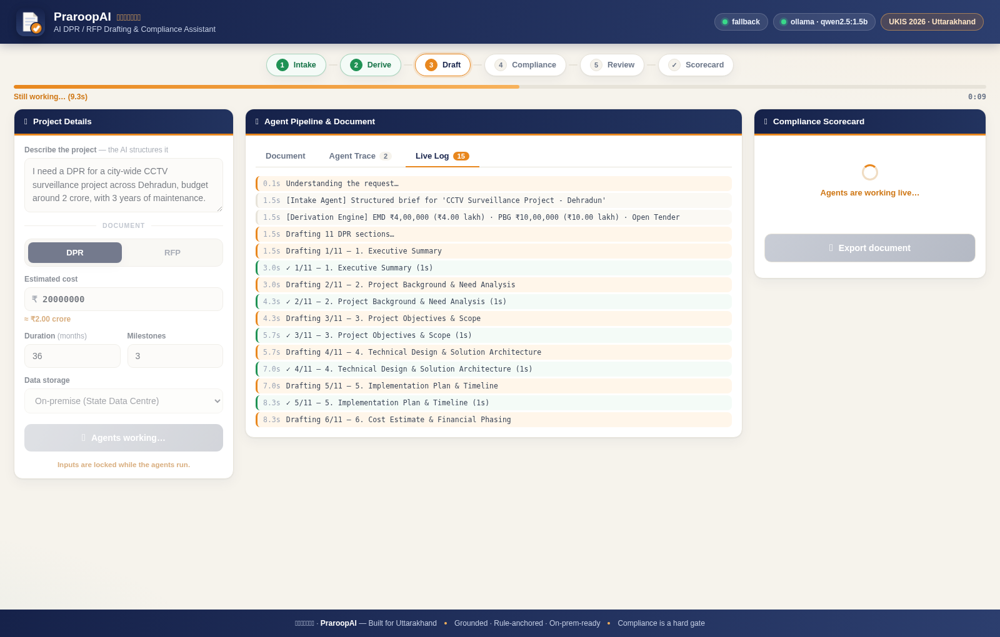

<div align="center">


# प्रारूप · PraroopAI

### AI DPR/RFP Drafting &amp; Compliance Assistant

*Draft it right the first time.*

**UKIS 2026 · ITDA, Government of Uttarakhand**


</div>

---

## What is PraroopAI?

Preparing a government **DPR** or **RFP** means satisfying dozens of mandatory rules —
financial norms, procurement/GFR guidelines, security requirements, service levels and
penalty clauses. Miss one clause and the tender is rejected or flagged in audit.

**PraroopAI** is a **LangGraph multi-agent system** that drafts the document with an LLM,
then hands it to a **deterministic compliance critic** that audits it against public
government rule-packs. Compliance is a **hard gate** — the document *cannot* be exported
while a mandatory check is failing.

| | |
|---|---|
| 🤖 **Multi-agent pipeline** | intake → derive → draft → compliance → reviewer, with a real feedback loop |
| 📡 **Live progress** | progress bar, per-section streaming and a Live Log tab — never a silent wait |
| 🔍 **Real logging** | `LOG_LEVEL=TRACE\|DEBUG\|INFO\|WARNING` shows every LLM call with timing |
| 🧠 **LLM writes the prose** | every section is generated; no hardcoded document text |
| 🧮 **Code does the maths** | EMD, PBG, penalty caps and milestone amounts are computed in Python |
| 🛡️ **Deterministic compliance** | rules run in code, so compliance can never hallucinate |
| 📖 **Citation-grade** | every finding cites its basis (GFR 2017, IT Act, MeitY model RFP) |
| 🔒 **Hard gate** | export returns **HTTP 423** while any mandatory finding is open |
| 🔌 **Any LLM provider** | switch by editing one line of `.env` |

---

## Live progress

A run makes **one LLM call per section** (7 for an RFP, 11 for a DPR), so on a small local
model it takes 1–3 minutes. The UI streams every step so you always know what is happening:



---

## Quickstart

```bash
python -m venv .venv
source .venv/bin/activate          # Windows: .venv\Scripts\activate
pip install -r backend/requirements.txt

cp .env.example .env               # Windows: copy .env.example .env
ollama pull qwen2.5:7b

./run.sh                           # Windows: run.bat
```

Open **<http://localhost:8080>** — the backend serves the UI, so there is
**nothing separate to start**.

> 💡 **Model size matters.** `qwen2.5:1.5b` runs but writes thin prose.
> Use **`qwen2.5:7b` or `14b`** for documents that read like real government drafts.

### Seeing what it is doing

```ini
# .env
LOG_LEVEL=DEBUG
```

```
10:29:19 INFO  praroopai.agents  [draft] start - 7 RFP sections, up to 14 LLM calls
10:29:19 INFO  praroopai.llm     -> draft:1. Scope of Work | ollama/qwen2.5:7b | prompt 1446 chars
10:29:19 INFO  praroopai.llm     <- draft:1. Scope of Work | 0.5s | 359 chars
10:29:19 INFO  praroopai.agents  [draft] 1/7 1. Scope of Work    0.5s  359 chars
```

Use `LOG_LEVEL=TRACE` to dump the full prompt and full model reply.
See **[docs/TROUBLESHOOTING.md](docs/TROUBLESHOOTING.md)** if anything looks stuck.

---

## Switching LLM providers

Change **one line** in `.env`. No code edits, no redeploy.

```ini
LLM_PROVIDER=ollama          # ollama | openai | openrouter | anthropic | openai_compatible
LLM_MODEL=qwen2.5:7b
```

| `LLM_PROVIDER` | Example `LLM_MODEL` | Needs |
|---|---|---|
| `ollama` | `qwen2.5:7b`, `llama3.1:8b` | local Ollama (on-prem) |
| `openai` | `gpt-4o-mini` | `OPENAI_API_KEY` |
| `openrouter` | `anthropic/claude-3.5-sonnet` | `OPENROUTER_API_KEY` |
| `anthropic` | `claude-3-5-sonnet-20241022` | `ANTHROPIC_API_KEY` |
| `openai_compatible` | any | vLLM / LM Studio / Together / Groq |

Providers use each vendor's **native REST API** via `httpx` — no vendor SDKs required.

---

## How it works

```
             ┌──────────── mandatory findings ────────────┐
             ▼                                            │
intake ──► derive ──► draft ──► compliance ──► reviewer ───┘
 (LLM)      (code)     (LLM)      (code)         (LLM)
                                     │
                                     └── clean ──► score ──► END
```

* **intake** — turns a plain-language request into a structured brief
* **derive** — computes EMD / PBG / LD cap / milestone amounts *deterministically*
* **draft** — writes each section with the LLM, **one focused call per section**
* **compliance** — the *independent critic*: runs every rule-pack in code
* **reviewer** — rewrites only the failing sections, then loops back for a re-check
* **score** — builds the scorecard and opens or closes the export gate

The only cycle is **compliance ⇄ reviewer**. Because compliance is pure code, a
"100% compliant" verdict is a fact, not a model opinion.

---

## The knowledge = bounded rule-packs

Small, public, versioned **YAML** — *not* a document corpus.

| Pack | Covers | Example citation |
|---|---|---|
| `financial.yaml` | EMD, PBG, milestone payments | GFR 2017, Rule 170 / 171 |
| `procurement_gfr.yaml` | Scope, eligibility, tender mode | GFR 2017, Rule 161 / 173 |
| `security.yaml` | Data security, retention, audit | IT Act 2000, Sec 43A |
| `sla.yaml` | Uptime, response, service credits | MeitY Model RFP |
| `penalty.yaml` | Liquidated damages, per-milestone penalty | GFR 2017, Rule 175 |
| `dpr_completeness.yaml` | DPR-only sections (need analysis, risk, outcomes) | MoSPI DPR guidelines |

Statutory ratios live in [`config/statutory.yaml`](config/statutory.yaml).

---

## API

| Method | Route | Purpose |
|---|---|---|
| `GET` | `/api/health` | engine, provider, model, tuning, LLM call stats |
| `GET` | `/api/rulepacks` | active packs and versions |
| `GET` | `/api/structure/{doc_type}` | section outline for RFP or DPR |
| `POST` | `/api/run` | run the pipeline (single JSON response) |
| `POST` | `/api/run/stream` | **SSE** — `step` / `node` / `progress` / `ping` / `complete` |
| `POST` | `/api/export` | DOCX download — **HTTP 423** if a mandatory finding is open |

---

## Project structure

```
praroopai/
├── .env.example              ← LLM provider, log level, pipeline tuning
├── config/statutory.yaml     ← statutory ratios (EMD/PBG/LD)
├── backend/
│   ├── app.py                ← FastAPI: serves the UI + API
│   ├── config.py             ← .env → typed Settings
│   ├── logging_setup.py      ← TRACE/DEBUG/INFO logging
│   ├── llm/                  ← provider-agnostic client (+ call timing)
│   ├── core/                 ← derivations · rule_engine · context · scorecard
│   └── services/             ← gated DOCX export
├── agents/
│   ├── graph.py              ← LangGraph StateGraph + threaded streaming
│   ├── nodes.py              ← the six node functions
│   ├── progress.py           ← live progress bus for long-running nodes
│   ├── doc_structure.py      ← RFP (7) vs DPR (11) section sets
│   └── prompts.py            ← all LLM prompts
├── rule_packs/*.yaml         ← 6 packs, 24 rules
├── frontend/                 ← no-build UI (HTML + CSS + JS) and icons
├── tests/                    ← 24 tests + a mock LLM server
└── docs/TROUBLESHOOTING.md
```

---

## Tests

```bash
python tests/test_pipeline.py    # 14 — engine, maths, hard gate, DPR completeness
python tests/test_providers.py   #  5 — all provider adapters route correctly
python tests/test_logging.py     #  5 — log levels and the progress bus
python tests/run_e2e.py          # full pipeline for both RFP and DPR (mock LLM)
```

No API key or model needed — `tests/mock_llm_server.py` emulates Ollama locally.
Set `MOCK_DELAY=1.5` to simulate a slow model and watch the progress stream.

---

<div align="center">

**PraroopAI (प्रारूप)** — *Built for Uttarakhand.* · MIT Licensed

</div>
